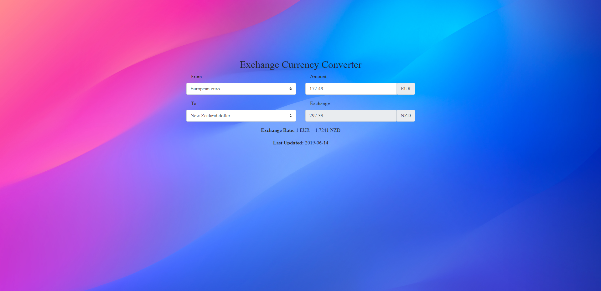
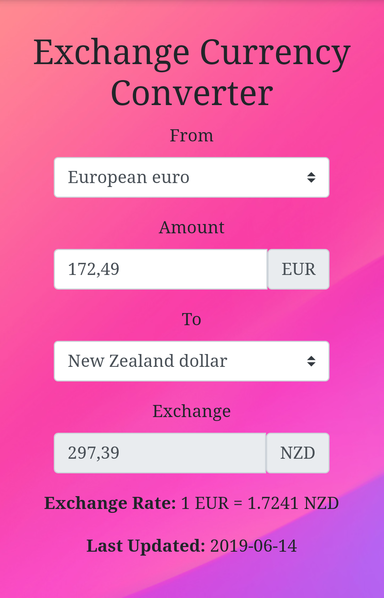

<!-- PROJECT HEADER -->
 

  <h3 align='center' style='font-size: 32px'>Exchange Currency App</h3>
  

    Application for calculating the exchange between the most known currencies.
     
     
    <a href='https://skkarolinav.github.io/exchange-currency-app/' style='font-size: 20px'>View Live Demo</a>
  

#
<!-- TABLE OF CONTENTS -->
## Table of Contents

* [About the Project](#about-the-project)
  * [Built With](#built-with)
* [Getting Started](#getting-started)
* [License](#license)
* [Contact](#contact)

#
<!-- ABOUT THE PROJECT -->
## About The Project

  PC display
  
   
  Mobile display
   
  

The project was created using React.js.

Desired curriences are searched in the database and then the exchange amount is provided with the exchange rate information and date of last update.

### Built With
To create this application I used:
* [React.js](https://reactjs.org)
* [Bootstrap](https://getbootstrap.com) 
* [Exchange Rate Api](https://exchangeratesapi.io/)

#
<!-- GETTING STARTED -->
## Getting Started

To run this application select the currency you want to convert from and the currency you want to convert to and also specify the amount of exchange you are interested in.

#
<!-- LICENSE -->
## License
Distributed under the MIT Licence.

#
<!-- CONTACT -->
## Contact

Name and Surname:  Karolina Banasiewicz 

E-mail: skkarolinav@gmail.com

GitHub: [Link](https://github.com/Skkarolinav)

LinkedIn: [Link](https://www.linkedin.com/in/karolina-banasiewicz-661a00188/)
